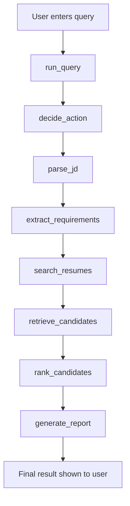

# End-to-end flow: from query to final answer

The full flow is orchestrated by the LangGraph workflow in `matching_agent.py`, with the actual matching logic living in `job_matcher.py` and the resume indexing/RAG layer in `resume_rag.py`.

---

## 1) Query enters the app

The user enters a prompt in the Streamlit UI or the CLI. In the app path, the UI calls `run_query(...)` from `matching_agent.py`, which builds the input state and invokes the graph.

The graph receives:

- the raw user query
- the conversation history
- any previous shortlist
- the job understanding state

This keeps the workflow stateful across follow-up questions.

---

## 2) The graph decides what kind of action this is

The first node is `decide_action` in `matching_agent.py`.

Inside it:

- `_detect_action(query)` checks the text for patterns like:
  - `search`, `find`, `suggest candidates`
  - `compare`
  - `interview questions`
  - `explain ranking`
  - `generate report`
- it decides whether the system needs a fresh retrieval step or can reuse existing candidates

Then it sets:

- `action`
- `next_step`

For example:

- a first-time “find candidates for this JD” query goes to `parse_jd`
- a follow-up “compare these two candidates” query may skip retrieval if a shortlist already exists

---

## 3) Job description is extracted and normalized

The next node is `parse_jd` in `matching_agent.py`.

This does two things:

- calls `_extract_job_description_with_llm(query)`
- falls back to a regex-based cleanup if the LLM is unavailable or fails

That helper strips conversational wrappers like “find candidates for...” and keeps the actual job description.

Then `extract_requirements_node` in `matching_agent.py` calls `extract_requirements(...)`, which in turn calls `_matcher()` and then `extract_job_requirements(...)` from `job_matcher.py`.

This extracts:

- must-have skills
- nice-to-have skills
- minimum experience years

So by the end of this stage, the system has a clean job requirement object.

---

## 4) Resume search and retrieval

The `search_resumes` node in `matching_agent.py` calls the matcher.

It does this via:

- `_matcher()` -> imports `retrieve_candidates`
- `retrieve_candidates(query, top_k=10, explain=False)` from `job_matcher.py`

This is the real hybrid retrieval stage.

Inside `retrieve_candidates(...)`:

1. It gets the stored Chroma vector DB via `get_vector_db()` from `resume_rag.py`.
2. If the DB is missing or stale, it builds it with `read_file_data_and_create_vector_db()`.
3. It loads resume chunks and metadata.
4. It computes:
   - dense similarity using a sentence transformer embedding
   - BM25 lexical similarity
   - reciprocal rank fusion (RRF) to combine both rankings
5. It groups chunks by candidate.
6. It computes evidence for each candidate:
   - matched skills
   - years of experience
   - relevant excerpts
   - qualified status
7. It creates a final `match_score`.

This is the key part where the assistant decides “who looks like the best fit.”

---

## 5) The actual ranking logic

After each candidate is scored, the code in `job_matcher.py` does the ranking.

Important signals:

- must-have skill coverage is weighted heavily
- skill match quality matters
- evidence score matters
- experience matters
- the final composite score is normalized and rounded

The code then sorts candidates like this:

- first: must-have satisfaction
- then: skill match quality
- then: evidence
- then: experience
- then: final composite match score

This prevents a resume that is semantically similar but lacks required skills from outranking a better-fit resume.

---

## 6) The graph passes ranked results to the report node

The `rank_candidates` node in `matching_agent.py` takes the shortlisted matches and creates:

- `shortlisted_candidates`
- `screening_rounds`

Then `generate_report` in `matching_agent.py` decides the final response format based on the action.

Examples:

- for a normal search: it produces a list like:
  - “1. Candidate X - 93/100. Reasoning…”
- for `compare`: it creates a side-by-side table-like comparison
- for `interview_questions`: it generates screening questions for a chosen candidate
- for `explain_ranking`: it explains why one candidate outranked another
- for `ask_llm`: it sends the shortlist and history to ChatOpenAI for a final natural-language answer

So the final result is not a raw database result; it is a user-friendly narrative or structured answer built from the ranked shortlist.

---

## 7) How the resume files are actually fetched

The resume content used in retrieval is not read directly from plain Python file code. It goes through the MCP filesystem layer:

- `filesystem_mcp_server.py`
- `mcp_client.py`
- `fs_tools.py`

This layer is responsible for:

- listing resumes
- reading file contents
- watching a directory
- batch-processing involved files

Then `resume_rag.py` uses that MCP client to:

- discover resumes
- index new ones
- split them into sections
- store chunk metadata in Chroma

So the agent does not manually parse files; it uses MCP tools to fetch the resume content in a clean, reusable way.

---

## In one sentence

The flow is:

User query -> graph decides action -> extract JD -> resolve must-have requirements -> retrieve and rank resumes with hybrid RAG + BM25 scoring -> generate final report tailored to the user request.
