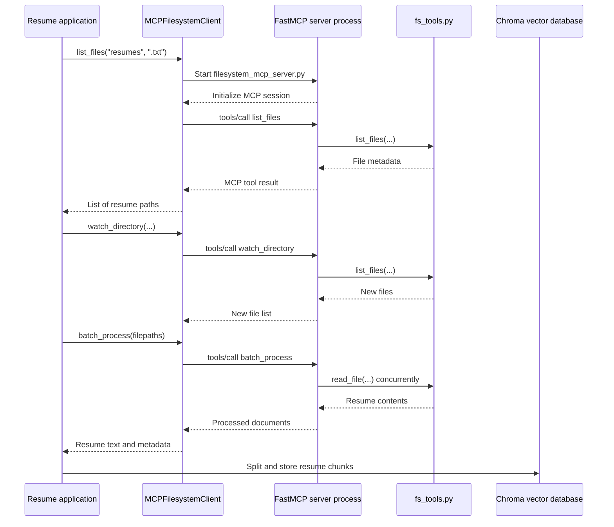

# MCP flow in the application

MCP is used as a filesystem layer between the resume application and the resume files.



## 1. The application creates the MCP client

The application creates `MCPFilesystemClient` in `resume_rag.py`.

```python
client = MCPFilesystemClient(root_directory="resumes")
```

The client knows:

- which Python script starts the server
- which Python interpreter to use
- which directory contains the resumes
- how to communicate through standard input and output

The default server script is:

```text
filesystem_mcp_server.py
```

---

## 2. The client prepares the server process

When the client needs to call a tool, `_server_params()` in `mcp_client.py` creates the server configuration:

```python
StdioServerParameters(
    command=python_executable,
    args=[server_script],
    env=...,
    cwd=...
)
```

Conceptually, it prepares a command similar to:

```text
python filesystem_mcp_server.py
```

The resume directory is passed through the `MCP_FILESYSTEM_ROOT` environment variable.

---

## 3. The FastMCP server starts

The server starts through the `__main__` block in `filesystem_mcp_server.py`:

```python
asyncio.run(
    build_fastmcp_server(...).run_stdio_async()
)
```

`build_fastmcp_server()` creates a `FastMCP` instance and registers four tools:

- `list_files`
- `read_file`
- `watch_directory`
- `batch_process`

The decorators make ordinary Python functions available as MCP tools:

```python
@server.tool(name="list_files")
def list_files_tool(...):
    return list_files(...)
```

FastMCP handles:

- MCP protocol messages
- tool registration
- argument validation
- serialization
- stdio communication
- server lifecycle

The project does not manually implement JSON-RPC messages.

---

## 4. The client establishes an MCP session

The `_run()` method in `mcp_client.py` opens the connection:

```python
async with stdio_client(self._process) as (read_stream, write_stream):
    async with ClientSession(read_stream, write_stream) as session:
        await session.initialize()
        return await action(session)
```

The sequence is:

1. Start the FastMCP server process.
2. Create an input stream and output stream.
3. Create an MCP `ClientSession`.
4. Call `session.initialize()`.
5. Perform the requested tool call.
6. Return the result.
7. Close the temporary connection.

Although the MCP library is asynchronous, `MCPFilesystemClient` exposes simple synchronous methods to the rest of the application.

---

## 5. The application calls a filesystem tool

For example, `resume_rag.py` calls:

```python
client.list_files(directory, extension)
```

This eventually becomes:

```python
client.call_tool(
    "list_files",
    directory=directory,
    extension=extension,
)
```

Then `call_tool()` sends:

```python
session.call_tool(
    name="list_files",
    arguments={
        "directory": directory,
        "extension": extension,
    },
)
```

The MCP request travels through the stdio connection to the FastMCP server.

---

## 6. FastMCP routes the request to the correct function

FastMCP receives the request and finds the registered tool named `list_files`.

It then calls:

```python
list_files_tool(directory, extension)
```

That wrapper calls the local server function:

```python
list_files(directory, extension)
```

The server function lazily imports the implementation from `fs_tools.py`:

```python
list_files_tool, _ = _filesystem_tools()
return list_files_tool(directory, extension)
```

This creates a simple separation:

```text
MCP protocol
    |
FastMCP tool wrapper
    |
filesystem_mcp_server.py
    |
fs_tools.py
    |
Actual filesystem operation
```

---

## 7. The tool result travels back to the client

The filesystem result travels in the opposite direction:

```text
fs_tools.py
    -> FastMCP server
    -> MCP response
    -> stdio stream
    -> ClientSession
    -> MCPFilesystemClient
    -> resume_rag.py
```

`_normalise_tool_result()` in `mcp_client.py` extracts the useful Python value from the MCP response.

For example, the client converts the MCP response into:

```python
[
    {
        "filepath": "resumes/Harsh_resume.txt",
        "filename": "Harsh_resume.txt",
        "success": True,
    }
]
```

The rest of the application does not need to understand MCP response envelopes.

---

## 8. How resume indexing uses MCP

When the vector database is created or refreshed, `resume_rag.py` performs this sequence:

### Step 1: Find supported files

`_resume_paths(...)` calls:

```python
client.list_files(directory, ".pdf")
client.list_files(directory, ".docx")
client.list_files(directory, ".txt")
```

### Step 2: Detect new files

```python
client.watch_directory(
    directory,
    known_files=list(known_paths),
)
```

The server compares the current files against the already indexed files.

### Step 3: Read files in parallel

```python
client.batch_process(filepaths)
```

The FastMCP server runs:

```python
ThreadPoolExecutor(...)
```

and calls `read_file()` for each resume concurrently.

### Step 4: Build the vector database

The returned resume documents are then:

1. split into sections
2. split into smaller chunks
3. enriched with metadata
4. embedded
5. stored in Chroma

MCP itself does not create embeddings or perform ranking. It only supplies the resume files and their contents.

---

## 9. What happens during a normal user query?

There are two cases.

### First run or new resume detected

```text
User query
    -> LangGraph workflow
    -> retrieve_candidates()
    -> get_vector_db()
    -> MCP list_files/watch_directory/batch_process
    -> refresh Chroma if needed
    -> search Chroma and rank candidates
    -> generate report
```

### Database already up to date

```text
User query
    -> LangGraph workflow
    -> retrieve_candidates()
    -> get_vector_db()
    -> Chroma already contains resume chunks
    -> hybrid search and ranking
    -> generate report
```

The MCP server may still be contacted during the database freshness check, but the application does not reread and re-embed every resume unnecessarily.

---

## 10. MCP tools available to the agent

`get_agent_tools()` in `matching_agent.py` exposes the filesystem methods:

```python
{
    "list_files": filesystem.list_files,
    "read_file": filesystem.read_file,
    "watch_directory": filesystem.watch_directory,
    "batch_process": filesystem.batch_process,
}
```

The agent can therefore access filesystem operations through normal Python methods, while those methods internally communicate with the FastMCP server.

The complete architecture is:

```text
Streamlit UI
    -> LangGraph
        -> resume matcher
            -> MCP client
                -> FastMCP server
                    -> fs_tools.py
                        -> resume files
```

The key responsibility of each layer is:

| Layer | Responsibility |
|---|---|
| Streamlit | Accepts the user query and displays the result |
| LangGraph | Controls the workflow |
| Job matcher | Retrieves and ranks candidates |
| MCP client | Connects the application to the filesystem server |
| FastMCP server | Exposes filesystem functions as MCP tools |
| `fs_tools.py` | Performs actual file operations |
| Chroma | Stores searchable resume chunks |

So MCP is the controlled bridge between the application and the resume filesystem.
